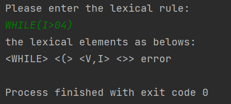

### 项目简单介绍
这是针对PLO语言的编译器的词法分析部分用C++实现的一个程序。有关
PLO语言的介绍，可参考[百度百科](https://baike.baidu.com/item/plo/1880974)
但这里使用的词法规则略有不同，如下：
 1. 关键字：PROGRAM BEGIN END CONST VAR WHILE DO IF THEN
 2. 标识符：以字母开头的，但可以包含字母和数字的字符串
 3. 整数：要么是零，要么只能以1到9开头，但可以包含如何数字
 4. 界符，算符：, ; + - * / ( ) := >= <= <> < >
 
### 实现原理
 首先由以上的词法规则可以生成以下的正规表达式：
```
keyword->PROGRAM|BEGIN|END|CONST|VAR|WHILE|DO|IF|THEN
identifier->(a|b|c|d|e|f|g|h|i|j|k|l|m|n|o|p|q|r|s|t|u|v|w|x|y|z|A|B|C|D|E|F|G|H|I|J|K|L|M|N|O|P|Q|R|S|T|U|V|W|X|Y|Z)
(a|b|c|d|e|f|g|h|i|j|k|l|m|n|o|p|q|r|s|t|u|v|w|x|y|z|A|B|C|D|E|F|G|H|I|J|K|L|M|N|O|P|Q|U|V|W|X|Y|Z|0|1|2|3|4|5|6|7|8|9)*
integer->(0|((1|2|3|4|5|6|7|8|9)(0|1|2|3|4|5|6|7|8|9)*))
delimiter->+|-|*|/|(|)|>|<|,|;|<=|>=|<>|:=
```
本项目是采用经典的自动机来解决词法分析的问题。步骤如下：
 1. [x] 由thompson算法将以上的正规表达式生成NFA
 2. [X] 使用子集法生成状态数更少的DFA
 3. [ ] 使用状态等价法化简DFA
 4. [X] DFA代码化

这里不在赘述thompson算法，而是介绍一下本程序是如何实现thompson
算法的。

首先需要考虑的是将正规表达式由中缀表示转换为后缀表示，为什么呢？因为
中缀表达式人是很容易理解和计算的，但对于电脑来说就不是那么容易了。但
后缀表达式结合栈的使用却能让电脑按照正确的实现计算，得出正确的结果。
这里对于后缀表达式生成的原理也不在赘述。实现本过程的函数是`generateSuffix`,传入一个字符串，返回这个字符串的后缀形式。

本程序定义的NFA的数据结构是一个二维数组，但其中的元素是vector,
相当于三维数组，定义如下：
```c++
vector<int>**NFA=new vector<int>*[500];
    for(int i=0;i<500;i++){
        temp[i]=new vector<int>[75];
    }
```
定义500是考虑的最大的NFA的状态数目也不会超过500，然后75是指所有
可能出现的字符只有75个（包括空字符ε），这样`NFA[i][j]`表示的就是
状态i在面对`mapping[j]`(所有可能出现字符的集合)所能转移到的状态
的集合。由于DFA转移状态的唯一性，所以DFA定义为一个二维数组，如下：
```c++
int **DFA=new int*[500];
    for(int i=0;i<500;i++){
        DFA[i]=new int[num];
        for(int j=0;j<num;j++)DFA[i][j]=-1;
    }
```
num是有效字符的数量（不包括空字符ε）

接下来先介绍实现thompson算法的四个核心运算:
 1. 单个字符的NFA构造算法：

     根据单个字符生成一个只有两个状态的NFA，状态0通过该字符到状态1，状态1为终态。
```c++
    answer[0][find(ch)].push_back(1);
    for(int i=0;i<75;i++){
        answer[1][i].push_back(-1);
    }
```
其中find(ch)为找到字符ch在mapping中的位置

 2. NFA的|（或）运算

    对两个NFA进行或运算，即构造一个新的起始态s1和一个新的终态s2,
s1通过空字符可以分别到达两个NFA的起始态，两个NFA的状态可以分别通过
空字符到s2.
```c++
    temp[0][74].push_back(1);
    temp[0][74].push_back(stateNum1+1);
    copyState(temp, left, 1);
    temp[stateNum1][74].push_back(stateNum1+stateNum2+1);
    copyState(temp, right, stateNum1+1);
    temp[stateNum1+stateNum2][74].push_back(stateNum1+stateNum2+1);
```
其中stateNum1是第一个NFA的状态数目，stateNum2是第二个NFA的状态数目
这里使用的copyState（n1,n2,begin)即将n2的状态复制到n1从begin开始

 3.NFA的*（闭包）运算

  对一个NFA进行闭包运算，即构造一个新的起始态s1和终态s2，s1通过空字符
可以分别到达s2或者NFA的起始态，NFA的终态可以通过空字符到终态，也可以
回到自己的起始态。
```c++
    temp[0][74].push_back(stateNum1+1);
    copyState(temp, item, 1);
    temp[0][74].push_back(1);
    temp[stateNum1][74].push_back(stateNum1+1);
    temp[stateNum1][74].push_back(1);
```
其中stateNum1是NFA的状态数。

 4. NFA的和运算

对两个NFA进行和运算，无须构造新的状态，只需要将第一个NFA的终态可以通过空字符
到达第二个NFA的起始态。
```c++
    copyState(temp, left, 0);
    copyState(temp, right, stateNum1);
    temp[stateNum1-1][74].push_back(stateNum1);
```
stateNum1是第一个NFA的状态数

定义完了四个核心运算后，开始从左往右扫描正规表达式，遇到字符则用单字符
NFA生成算法生成NFA压入栈中，遇到算符|则取出栈顶的两个NFA，进行或运算，
计算结果压回栈中，遇到算符*,则取出栈顶的一个NFA,进行闭包运算，计算结果
压回栈中。但正规表达式扫描完成的时候，这是栈中存在的所有NFA是需要用
和运算连接起来的。取出栈顶的两个NFA，进行和运算，计算结果入栈，重复直到
栈中只有一个NFA，就是我们的结果。

但是该方案有个***问题***，我们发现在PLO语言中也有*符号，这明显会引起歧义。这里
采用的解决方案是绕过正规表达式，因为这些对于单个符号和单个关键字，是没有
除和运算之外的算符的，所以我们直接用单字符NFA生成生成NFA。

NFA不适合作为词法分析的自动机，其有两个缺点：
- 状态数目过多
- 有不确定性，一个状态在面临一个符号的时候可能迁移到多个状态，不适合代码实现
- 有空字符，同样不利于代码的实现
 
所以我们要将NFA转换成DFA，方法是**子集法**

先介绍一个工具函数findEqual,传入一个NFA和一个状态init,返回一个状态集，
该集合包括所有在NFA中init经过若干个空字符能够到达的状态。
```c++
    answer.push_back(init);
    int history[500]={0};
    for(int i=0;i<answer.size();i++){
        if(history[answer[i]]==0){
            vector<int>temp1=NFA[answer[i]][74];
            for(int j=0;j<temp1.size();j++){
                if(temp1[j]>0)answer.push_back(temp1[j]);
            }
            history[answer[i]]=1;
        }
    }
```
history数组用来表示对应的状态有没有经过进一步的搜索

这样我们开始将NFA转换成DFA，我们从0的等价集作为起始态，考虑从这一个状态
集中的任何字符经过所有有效字符的某一个能够到达的新状态，对于得到的新状态
求其最大的等价集，这样循环直到没有新的状态集产生，这样我们就得到了一系列
的状态集以及这些状态集之间的跳转关系，以所有的状态集作为DFA的状态，根据
这些状态集之间的跳转关系为DFA赋值即可。这里考虑一点，对于NFA默认是唯一
的，即为最后一个状态，但是DFA的状态不唯一，所有包含了原先NFA终态的状态
集都是DFA的终态。生成DFA的函数签名如下：
```c++
int **convertDFA(vector<int>**NFA, vector<int>&indexes, int &statesNum, vector<int>&isEnd, int num1)
```
indexes是DFA中纵坐标对应字符在mapping中的位置，isEnd表示对应的状态
是否是终态。

这样我们就得到了确定有限自动机DFA。

事实上可以对DFA进一步化简，但这里暂时没有实现，但是这个DFA已经可以进行词法
分析了。

对于一个给定的DFA，进行词法分析的步骤也很简单，从DFA的起始态开始，从左往右
扫描字符串，但DFA在面对当前字符可以迁移到一个新的状态的时候，则迁移到新的状
态，继续直到不能接收该字符串或者字符串已经扫描完毕，则判断当前状态是否是终态，
如果是，则将产生的字符子串加入到结果集合中，否则报错。

由于考虑到关键字和标识符之间存在冲突，即如关键字VAR也可以被识别为一个标识符，
且为了标明词法单元的类型，我们采用4个类别的DFA识别字符串，分别对应以上的四种
词法单元的正规表达式。整体上的词法分析，依次用关键字DFA、标识符DFA、整数DFA、
算符界符DFA识别，这保证了VAR一定会被识别成关键字，只有当一个词法单元用这
四种DFA都没有办法识别的时候，我们认为这是一个非法的词法单元。

注意一个***问题***，用以上的方案，事实上形如3k的识别是有问题的，我们知道
3k应该是非法的，但以上的程序会将3k成整数3和标识符k,在本程序中，采用以下
解决方案：考虑到大多数的程序设计语言不会出现两个连续的非界符算符的词法单元，
他们之间一定有这样的符号：`,` `;` `(` `)` `|` `/` `+`或者空格` `,不会出现形如`IFTHEN`
`3K` `IFI>5`这样的情况，所以我们在词法分析中，识别出非算符界符的词法单元后，立刻
检查下一个符号是否是在界符数组中，如果不是，可以直接报错。

到这里，所有的词法分析该干的事情都做好了，我们将输入的程序语句分割成一个一
个的词法单元，将其传递给语法分析部分使用。

### 运行结果
我们用一个简单的正规表达式`l(l|d)*`来测试以下程序的各子程序。
我们输出得到的NFA如下图
注意以上图中~表示空字符ε，NFA的终态是状态9。

由NFA生成的DFA如下
注意-1只是一个占位符，终态有状态1,2,3

由该DFA分别识别字符串

接下来我们进行全局测试
- test1 ```VAR i1,j2,k3;```


- test2 ```VAR i1,j2,3k;```


- test3 ```IF(i>=5)```


- test4 ```VAR a=1,b=2,c=a*b;```


- test5 ```WHILE(I>04)```


### 总结
 1. 做这个项目最大的感受就是`纸上得来终觉浅`，当理论课上学到这些诸如thompson
算法、子集法等等，觉得是那么简单，也确实对于人来说是很容易利用这些算法画NFA、
DFA，但对于机器，却没有那么容易，就是简单的正规表达式机器也不能很好地理解，
而需求其后缀形式。这其中，数据结构的设计、循环的处理等等都是很麻烦的事情。
 2. 在这一个项目中，也遇到过一个问题，当时运行程序出现了匪夷所思的结果，然后
尝试着输出中间结果，不断判断，最终分析终端输入的字符串和输出的同一个字符串
居然不相同，看到该字符串中有空格，于是上网一查原来c++中的cin输入的字符串
遇到空格就会结束输入，所以采用`getline(cin,input)`的方式将字符串输入到
input中。


